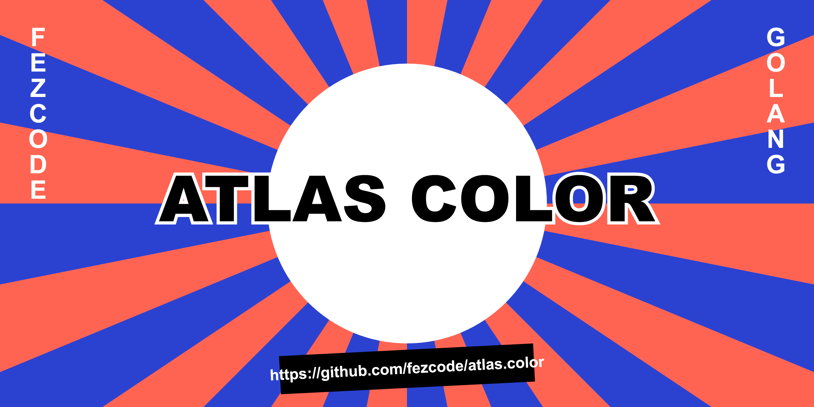

# atlas.color

Interactive TUI color picker and converter (Hex, RGB, HSL).



## Installation

```bash
gobake build
```

## Usage

```bash
./atlas.color
```

## Features
- Interactive RGB sliders.
- Real-time color preview in terminal.
- Live conversion to HEX, RGB, and HSL.
- Smooth navigation using keyboard (Arrows/HJKL).
